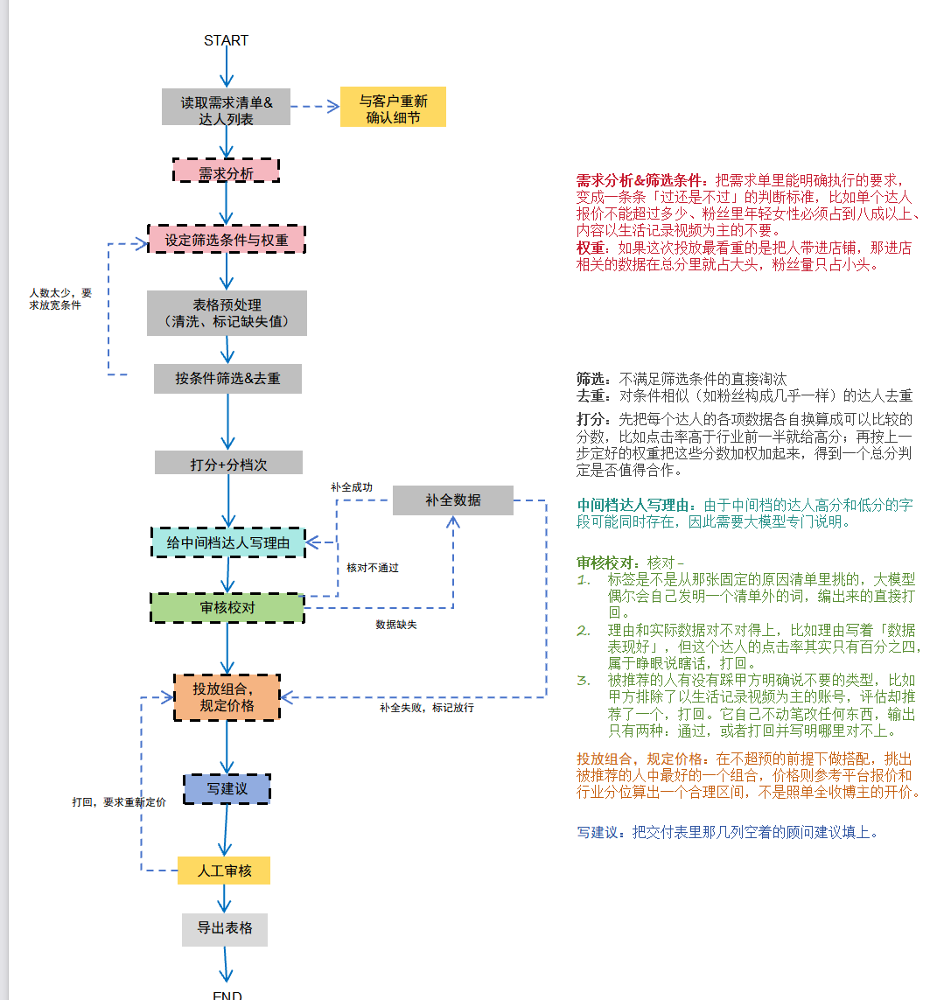

# SeedScout：小红书达人投放多智能体筛选系统

---

## 1. 项目背景

本项目的原型是一个跑在本地命令行里的达人投放评估数据后处理工具：读取一份人工填写的「荐号案例表」，先用字符串规则拆分结论与理由，再逐行调用大模型做原因归因，最后把结构化标签写回 Excel。原型是一条**固定流程的批处理管线**——读表、拆列、逐行调用、写回，步数和顺序在运行前就能完全画出来，因此它本身并不需要以 Agent 的方式实现。

本项目的扩展思路是：**把流程的不确定性引进来**。当系统需要面对一段非结构化的甲方需求、需要在信息不足时回头追问、需要根据中间结果决定下一步走哪条路、需要在环境失败时重试或绕行时，控制流本身不再可枚举，这才构成使用多智能体架构的理由。

## 2. 业务场景

系统模拟的是小红书达人投放中「选号与出方案」这段业务，参与者有三方：

| 角色 | 说明 |
|------|------|
| 品牌方（甲方） | 提出投放需求、给出预算、确定考核标准 |
| 广告代理方（我方） | 承接需求，负责筛选达人、评估、出方案，**系统的直接使用者** |
| 达人（KOL） | 被评估与推荐的对象，提供内容位 |

系统扮演代理方内部的「顾问助理」：接收甲方需求单与达人数据，产出一张填好推荐结论、原因标签与内容建议的达人推荐表，交由代理方顾问复核后转交甲方。

> **关于数据**：由于开发者已不持有蒲公英平台的企业账号与甲方原始需求单，数据获取环节采用**模拟**实现。模拟数据在字段名、类型与口径上对齐真实荐号工作表（该表的数据列来自蒲公英页面的人工转录），并刻意注入脏数据与边界情况以触发流程中的各条分支，验证的是判断流程本身，不依赖对平台的实际访问。

## 3. 总体流程设计



主干流程十二步，任何输入都按序执行：

| # | 节点 | 执行者 | 输入 → 输出 |
|---|------|--------|------------|
| 1 | 读取需求清单 & 达人列表 | 代码 | 需求单原文 + 整份达人表 |
| 2 | 需求分析 | 需求分析智能体 | 需求原文 → 从中读出的各项要求 |
| 3 | 设定筛选条件与权重 | 需求分析智能体 | 各项要求 → 「过/不过」的条件清单 + 各指标轻重比重 |
| 4 | 表格预处理（清洗、标记缺失值） | 代码 | 原表 → 可计算的达人数据 + 数据不全标记 |
| 5 | 按条件筛选 & 去重 | 代码 | 候选人名单（同机构账号、粉丝高度重叠者只留一个） |
| 6 | 打分 + 分档次 | 代码 | 每人总分与档位（明确值得 / 明确不值得 / 中间档） |
| 7 | 给中间档达人写理由 | 评估智能体 | 原因标签 + 一句话说明（按达人扇出并行） |
| 8 | 审核核对 | 审校智能体 | 核对无误的推荐名单和理由 |
| 9 | 投放组合，拟定价格 | 报价组合智能体 | 投谁、各投几条、什么形式、什么价 |
| 10 | 写建议 | 文案建议智能体 | 补全内容角度等顾问建议列的完整推荐表 |
| 11 | 人工审核 | 顾问（人） | 审核通过的最终版 |
| 12 | 导出表格 | 代码 | 交付客户的推荐表 |

六条条件分支：

1. **需求没说清** → 去和客户重新确认细节，本轮暂停等人，到此为止；
2. **人数太少** → 放宽筛选条件重筛（最多 3 次，防止与其他回退互相触发成死循环）；
3. **分数明确**（上档/下档）→ 代码直接从分数构成挑标签，**不经过审核核对**，直达投放组合；
4. **数据缺失**（审校发现）→ 缺的那条单独补数据；
5. **补全成功** → 送回评估重新看；**补全失败** → 打上「数据不全」标记后放行去投放组合，交人工审核裁决；
6. **被打回**（人工审核驳回）→ 要求重新定价。

**审核核对**：标签是否出自固定的原因清单（大模型不得发明清单外的词）；理由与实际数据是否对得上（例如写着「数据表现好」但点击率只有百分之四）；被推荐者有没有踩甲方明确排除的类型。审校智能体只读不写，输出只有「通过」或「打回并写明哪里对不上」。

**数据补充**：补的是缺失的字段值，不是人。谁的数据缺就补谁，分数高的照样要补。补不到的典型情形：博主从未发过视频（视频报价逻辑上不存在）、平台不展示该指标、查询超时重试仍失败。

## 4. 多智能体角色划分

采用 **Supervisor（主控）模式**：主控智能体自己不干活，只负责任务拆分、按序分派、汇总结果并决定下一步走向——图上的边和条件边本身就是主控的调度决策，因此主控不画成流程图上的一个节点。

| 智能体 | 职责 | 关键机制 |
|--------|------|----------|
| 需求分析智能体 | 读懂需求原文，拆出硬条件与软偏好 | 输出为结构化条件与权重 |
| 评估智能体 | 给中间档达人写推荐理由 | **按达人扇出**（每条一个实例，上下文隔离），LangGraph 中用 Send API 实现 map-reduce 并行 |
| 审校智能体 | 对抗式校验评估产出 | 只读不改，与评估构成生成/校验小循环 |
| 报价组合智能体 | 预算约束下定组合、定价 | 求解交代码，智能体负责翻译约束 |
| 文案建议智能体 | 补写内容角度等顾问建议列 | 输出受控枚举 |

**代码节点不包成智能体**：清洗、筛选去重、打分、算价这些子任务规则可写、结果可验证，它们是主控直接调用的工具函数。多智能体拆分的成立理由是三条——上下文隔离（单条评估不需要整份需求与其他候选人）、生成与校验分离（模型查不出自己的错，审校必须拿原始数据独立核对）、任务天然并行（二十条达人互相独立）。为凑数量把代码节点包成智能体只会增加成本与不确定性。

## 5. 受控原因清单

评估智能体与代码挑标签**共用同一张固定清单**（原文写死于 `models/Classification.py` 的两段系统提示词），模型只能从中选词，禁止发明清单外的标签：

- **推荐侧（11 个）**：数据好 / 进店好 / 内容契合 / 人设契合 / 粉丝匹配 / 展示形式合适 / 剧情植入适合 / 阅读互动强 / 题材匹配 / 风格匹配 / 其它
- **不推荐侧（21 个）**：阅读低 / 数据差 / 数据不稳 / 内容不合适 / 账号类型不合适 / 机构号 / vlog为主 / 粉丝不匹配 / 价格贵 / 更新少 / 内容水 / 商单表现差 / 破圈账号不符 / 美妆类不符 / 彩妆号 / 粉丝年龄大 / 粉丝年龄小 / 消费力弱 / 人设不符 / 内容杂乱 / 其它

分数明确的达人无需调用大模型：哪个指标主导了总分，标签就是哪一条（如又便宜数据又好 → 「数据好」；分数被报价拖垮 → 「价格贵」），由代码直接挑出，又快又不会编造。

## 6. 模拟数据设计

模拟达人表采用**两层结构**：

1. **初次读表层**：故意挖空部分字段（如某达人整行价格缺失、进店数以 `-` 占位），用于触发清洗与补数分支；
2. **完整底表**：补数工具的查询来源，大部分缺失字段可在此查回；同时**故意保留个别在底表中也不存在的字段**（如从未发过视频的博主的视频报价），使「补全失败，标记放行」这条路径真实可达、可测试。

此外注入的脏数据与边界情况包括：同 MCN 旗下多账号（触发去重）、机构官方号（高粉高价的低效样本）、vlog 为主的账号（撞甲方排除项）、粉丝年龄结构错配、中英文逗号混用等；数值保持自洽（CTR ≈ 阅读/曝光，CPV ≈ 报价/阅读），不会出现一眼即假的数据。


## 7. 运行方式与实现路线

**当前可运行的原型基线**：

```bash
pip install openai openpyxl pandas python-dotenv
python main.py     # 1-拆列  2-AI分类  3-AI预测  4-退出
```

`.env` 配置：`API_KEY`、`BASE_URL`（OpenAI 兼容接口）、`FILE_PATH` / `FILE_PATH2` / `OUTPUT_FILE`、`DELAY`（调用限速秒数）。


